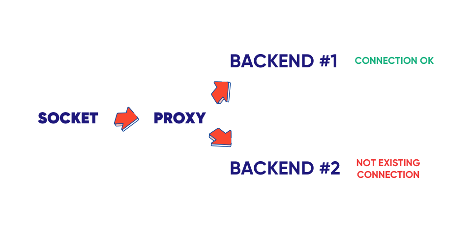
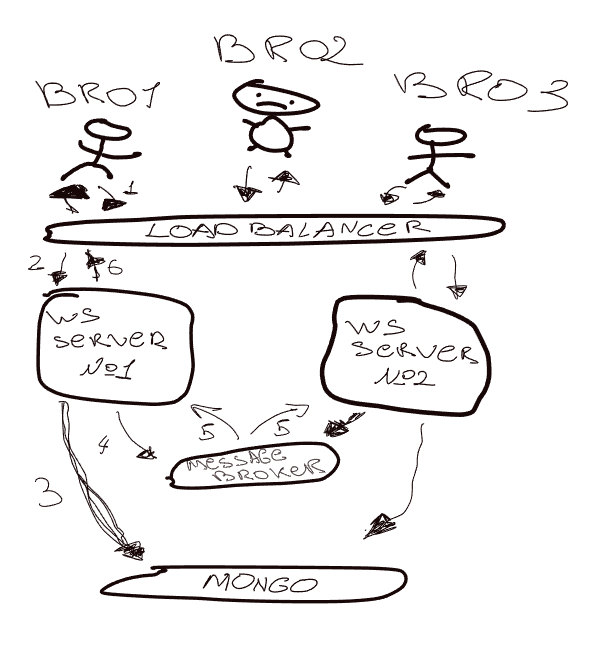
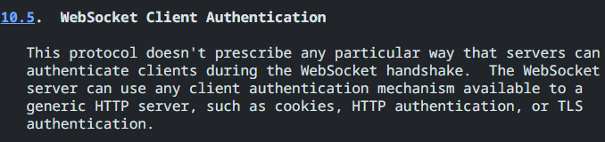

# Long Polling / Server-sent-events / Websockets

## Topics:
1. [Long Polling](#long-polling)
2. [Server-sent-events](#server-sent-events)
3. [О Websocket-аaхххх](#websocket)
4. [Links](#links)

## Long Polling
Позволяет получать данные о новых событиях с помощью длинных запросов.

Краткая схема такова:

    1. Отправляется запрос на сервер
    2. Соединение не закрывается сервером
    3. Как только появляется новое событие - сервер сразу же отвечает
    4. Клиент тут же отправляет новый ожидающий запрос


<p style="text-align:center; color:gray;">Example of long polling</p>

**Long polling** имел ограничения при использовании HTTP/1 по количеству подключений к домену. Соответственно, использовать его было не практично.
Проблема была решена с появлением HTTP/2, где появился мультиплексинг,
возможность использования одного TCP соединения на несколько таких запросиков.

**Минусы**:
* **Новые конекшены** - Каждый раз делаем новый запрос.
* **Жирные хеддеры** - При каждом запросе нам так же придется отправлять хеддеры, которые в свою очередь могут спокойно весить столько же или даже больше чем инфа за которой мы пошли.
* **Пустые ответы** - можем отправить запрос на сервер, а в ответ ничего не получить
* **Большая задержка**
* **Неполная передача данных** - в некоторых случаях не можем передать полный набор данных за один ответ, к примеру из-за его размера

**Плюсы**:
* **Изи** - Этот бро легко настраиваемый и не нужно прописывать до настроек на своем прокси сервере или как клибо вообще менять настройки сервера, тк работает поверх http
* **Можно сжимать данные** - тк работает поверх http

## Server-sent events
Так же имеет ограничение при работе с `HTTP/1` по количеству соединений на домен в браузере. С появлением `HTTP/2` стали хорошей альтернативой `WS`.
Это обычный `http-запрос`, который приходит на сервер и остается открытым, пока не закроется на клиенте.

**Server-sent events** похожи на `long polling`. Однако, когда приходит `http-запрос`, он не закрывается при получении данных или по таймауту, а является долгоживущим, как и вебсокеты.

Из особенностей можно рассказать, что в отличии от `WS`, `SSE` имеет одностороннюю связь - сервер может отправлять данные клиенту, но клиент не может по тому же соединению отправлять данные обратно. Так же могут возникнуть проблемы при желании отправить бинарные данные, `SSE` такого не поддерживает из коробки.


<p style="text-align:center; color:gray;">Example of sse</p>


`SSE` так же легко настроить как и со стороны сервера так и со стороны клиента. В клиентской части достаточно указать эндпоинт и... все.
```html
<body>
    <p id="sse"></p>
    <script>
        const text = document.getElementById("sse");
        const src = new EventSource("/sse-example");
        src.onmessage = function(event) {
            const data = event.data;
            text.innerText = data;
        };
    </script>
</body>
```
Со стороны сервера все тоже не сложно
```python
from fastapi.responses import StreamingResponse

...

async def get_sse_datetime():
    while True:
        data = str(datetime.now())
        yield f"data: {data}\n\n"
        await asyncio.sleep(0.1)


@app.get("/sse-example")
async def sse():
    return StreamingResponse(get_sse_datetime(), media_type="text/event-stream")
```

Вот что мы получили


<p style="text-align:center; color:gray;">sse in devtools</p>

В `DevTools` мы можем увидеть 4 колонки:

`ID` - это идентификатор каждого сообщения. Он помогает нам отслеживать, какие сообщения уже были отправлены клиенту. Например, если клиент временно отключился от сервера, когда он снова подключится, мы сможем использовать этот `ID`, чтобы отправить только те данные, которые он еще не получил. Так мы не будем посылать ему одни и те же данные снова.

`Type` - отображает тип события. Это дает возможность клиенту обрабатывать различные типы событий и по разному на них реагировать.

`Data` - данные которые мы отправили с сервера.

`Time` - да бро, это время.

по дефолту есть 3 основных события, которые можно отслеживать:
* `onopen`
* `onmessage`
* `onerror`

Но так же можно прописывать и свои собественные ивенты. Для этого достаточно со стороны сервера, в сообщении указать `event: ...`

```python
yield f"event: update\ndata: {data}\n\n"
```

со стороны клиента можно отловить используя `addEventListener` и как-либо на него реагировать

```javascript
src.addEventListener("update", function(event) {
    const data = event.data;
});
```

Интересно то что сообщение отправляется с сервера только после указания `\n\n`. Если разделить 1 сообщение на несколько `yield` и в каждом указать разный `event` или `id`, то они попросту перезапишут себя и возьмутся последние значения, но вот с `data` другая история. В отличии от `event`, `data` сконкатинируется с предыдущими значениями:

```python
yield f"event: custom_1\nid: unique_2\ndata: {data}\n"
yield f"event: custom_2\nid: unique_1\ndata: +1\n\n"
```

Так же существуют след параметры которые можно кастить под задачи.

`comment` - Позволяет отправлять комментарии, которые будут проигнорированы клиентом. Это может быть полезно для отладки.
`retry` - Устанавливает интервал повторной попытки подключения, если соединение оборвалось.

Если браузер потерял соединение с сервером то он автоматически будет пробовать переподключиться к нему и это может помочь при балансировке нагрузки.

Из под коробки не поддерживает сжатие, но можно использовать сжатие, используя прокси (`nginx`) или сжатие от `http/2`. 

Чтобы дропнуть соединение можно использовать `eventSource.close()`

Некоторые прокси сервера могут убить соединение, если оно висит и по нему не идут какие-либо данные. Для того чтобы это пофиксить нужно реализовать `heartbeat`. Из под коробки `SSE` такого не поддерживает в отличии от `WS`.


## Websocket
Теперь наконец-то о вебсокетах.

`Websocket` это технология, позволяющая клиенту установить двустороннюю(полнодуплексную) связь с сервером. C помощью вебсокет и клиент, и сервер могут инициировать связь друг с другом, и оба могут отправлять сообщения одновременно. И http, и вебсокет отправляют сообщения через соединение `tcp`, которое является стандартом транспортного уровня, обеспечивающим надежную доставку данных.

Поток данных в `ws` состоит из фреймов. Эти фреймы могут быть следующих типов:
* `текстовые фреймы` – дефолтный текст
* `бинарные фреймы` – картинки, видосы, аудио
* `пинг-понг фреймы` - используется для проверки соединения. Отправляется с сервера, браузер реагирует на них автоматически
* `фрейм закрытия соединения` и некоторые другие служебные фреймы

Можно отправить огромный файл и вебсокеты разобьют его на кадры. Каждый кадр содержит небольшой заголовок, в котором указывается длина, а также является ли этот кадр последним. Так же стоит учитывать, что как и `sse` вебсокеты не предоставляют механизмов сжатия из под коробки и в отличии от `sse`, где сжатие можно получить благодаря `http/2` и прокси серверу, в вебсокетах за реализацию сжатия придется отвечать самому.

Если у клиента медленный инет, но отправляем данные снова и снова. То они будут буферизованы в памяти и отправлены лишь с той скоростью, которую позволяет сеть.
retry: Устанавливает интервал повторной попытки подключения, если соединение оборвалось.
`WebSocket` сам по себе не содержит такие функции, как переподключение при обрыве соединения, в отличии от `sse`. Так же не поддерживаются аутентификацию пользователей и другие механизмы высокого уровня.

Немного о маштабировании

Если речь идет о вертикальном маштабировании, то тут проблем никаких нет. Мы можем спойно купить миллион оператоса и держать триллиард активных соединений. все заибэго. Но если денег у нас чуть меньше, то можно воспользоваться горизонтальным маштабированием, с которым есть некоторые проблемы.

##### Проблема №1. Состояние
С REST все просто, они как бездушные роботы, не запоминают ничего о тебе, когда ты с ними общаешься. Но с WebSocket это не так. Они, как настоящие бро, помнят о тебе и твоих запросах. И вот если у нас несколько экземпляров, нужно как-то убедиться, что каждый из них обрабатывает своего пользователя.


<p style="text-align:center; color:gray;">Бро помнит</p>

Чтобы решить эту проблему можно использовать `липкую сессию`. Это особый вид балансировки нагрузки, при котором трафик поступает на один определенный сервер. Как правило, перед группой серверов находится балансировщик нагрузки, который и устанавливает правила распределения трафика между доступными серверами.

Вот пример конфигурации для `nginx`
```nginx
upstream some_ws_app {
    least_conn;
    sticky route $cookie_serverid;
    server web:6969;
    server web:6968;
}
```

##### Проблема №2. Трансляция
Когда мы хотим отправить сообщения всем клиентам WebSocket сразу, возникает затруднение. Сервер WebSocket, по сути, "знает" только о клиентах, подключенных к нему, но не знает о всех остальных. Это означает, что если мы просто отправим сообщение, оно дойдет только до тех клиентов, которые подключены к этому серверу.

Решение этой проблемы заключается в использовании паттерна pub/sub. Суть в том, что сервер, который хочет отправить сообщение всем клиентам, публикует это сообщение в канал, а все клиенты, которые подписаны на этот канал, получат сообщение. Таким образом, сообщение будет доставлено всем подключенным клиентам, независимо от того, на каком сервере они находятся. Для реализации этого механизма могут использоваться различные инструменты, такие как Redis, Kafka или RabbitMQ.



<p style="text-align:center; color:gray;">Вот как это выглядит (да, рисовал я.)</p>

###### Проблема №3. Авторизация
WebSocket и SSE появились более десяти лет назад, однако до сих пор в стандартах отсутствуют рекомендации по решению задачи аутентификации для подобных соединений.



<p style="text-align:center; color:gray;">Из RFC-6455</p>


## Links
### Статьи
* [WebSockets for fun and profit](https://stackoverflow.blog/2019/12/18/websockets-for-fun-and-profit/)
* [An Analysis of the Performance of Websockets in Various Programming Languages and Libraries](https://www.researchgate.net/publication/348993267_An_Analysis_of_the_Performance_of_Websockets_in_Various_Programming_Languages_and_Libraries)
* [Липкие сессии для самых маленьких](https://habr.com/ru/companies/domclick/articles/548610/)

### Видосы
* [Аутентификация для WebSocket до сих пор нет стандарта](https://www.youtube.com/watch?v=coinSGTsge0&feature=youtu.be)
* [SSE vs WebSockets vs Long Polling]()https://www.youtube.com/watch?v=n9mRjkQg3VE&ab_channel=FestGroup

### Остальное
* [source](https://github.com/nnnLik/tgk-websockets/tree/master)
* [benchmark source](https://github.com/matttomasetti?tab=repositories) (not mine 0_0)


ПОЧЕМУ ФРЕЙМЫ???