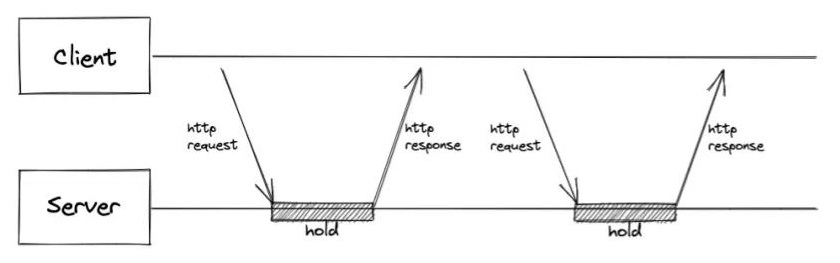
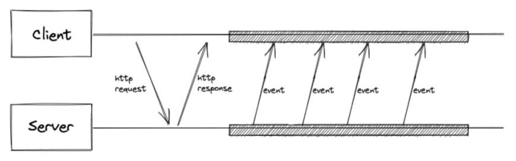
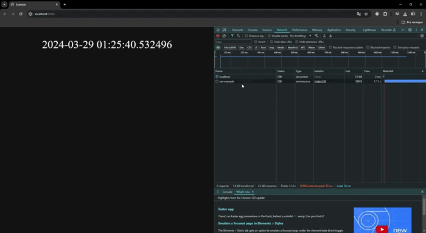
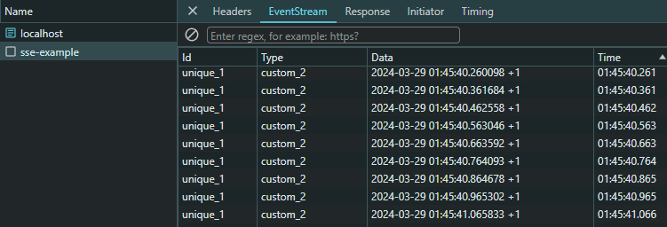

# Вебсокеты и другие приколы

## Topics:
1. [Intro](#intro)
2. [Long Polling](#long-polling)
3. [Server-sent-events](#server-sent-events)
4. [О Websocket-ахххх](#websocket)
5. [Some random benchmarks](#some-random-benchmarks)

### Intro
Перед вебсокетами стоит рассмотреть более простые, ранние технологии, 
такие как Long Polling и Server-Sent Events, которые выполняют те же функции и могут использоваться для того же что и вебсокеты.

### Long Polling
Позволяет получать данные о новых событиях с помощью длинных запросов.

Краткая схема такова:

    1. Отправляется запрос на сервер
    2. Соединение не закрывается сервером, пока не появится событие или не дропнется по таймауту
    3. Событие отправляется в ответ на запрос
    4. Клиент тут же отправляет новый ожидающий запрос




**Long polling** имел ограничения при использовании HTTP/1 по количеству подключений к домену,
всего 6 на браузер. Соответственно, использовать его было не практично.
Проблема была решена с появлением HTTP/2, где появился мультиплексинг,
возможность использования одного TCP соединения на несколько таких запросиков.

У лонг пулинга есть несколько основных проблем:
* Новые конекшены - Каждый раз делаем новый запрос.
* Жирные хеддеры - При каждом запросе нам так же придется отправлять хеддеры, которые в свою очередь могут спокойно весить столько же или даже больше чем инфа за которой мы пошли.

минусы:
* Пустые ответы - можем отправить запрос на сервер, а в ответ ничего не получить
* Большая задержка
* Неполная передача данных - в некоторых случаях не можем передать полный набор данных за один ответ, к примеру из-за его размера

плюсы:
* Изи - Этот бро легко настраиваемый и не нужно прописывать до настроек на своем прокси сервере или как клибо вообще менять настройки сервера, тк работает поверх http
* Нет проблем с прокси, фаерволами. Легче маштабировать чем ws 
* Можно сжимать данные

### Server-sent events
Так же имеет ограничение при работе с HTTP/1 по количеству соединений на домен в браузере. С появлением HTTP/2 стали хорошей альтернативой WS.
Это обычный http-запрос, который приходит на сервер и остается открытым, пока не закроется на клиенте.



**Server-sent events** похожи на `long polling`. Однако, когда приходит `http-запрос`, он не закрывается при получении данных или по таймауту, а является долгоживущим, как и вебсокеты.

Из особенностей можно рассказать, что в отличии от `WS`, `SSE` имеет одностороннюю связь - сервер может отправлять данные клиенту, но клиент не может по тому же соединению отправлять данные обратно. Так же могут возникнуть проблемы при желании отправить бинарные данные, `SSE` такого не поддерживает из коробки.

`SSE` так же легко настроить как и со стороны сервера так и со стороны клиента. В клиентской части достаточно указать эндпоинт и... все.
```html
<body>
    <p id="sse"></p>
    <script>
        const text = document.getElementById("sse");
        const src = new EventSource("/sse-example");
        src.onmessage = function(event) {
            const data = event.data;
            text.innerText = data;
        };
    </script>
</body>
```
Со стороны сервера все тоже не сложно
```python
from fastapi.responses import StreamingResponse

...

async def get_sse_datetime():
    while True:
        data = str(datetime.now())
        yield f"data: {data}\n\n"
        await asyncio.sleep(0.1)


@app.get("/sse-example")
async def sse():
    return StreamingResponse(get_sse_datetime(), media_type="text/event-stream")
```

Вот что мы получили



В DevTools мы можем увидеть 4 колонки:

`ID` - это идентификатор каждого сообщения. Он помогает нам отслеживать, какие сообщения уже были отправлены клиенту. Например, если клиент временно отключился от сервера, когда он снова подключится, мы сможем использовать этот `ID`, чтобы отправить только те данные, которые он еще не получил. Так мы не будем посылать ему одни и те же данные снова.

`Type` - отображает тип события. Это дает возможность клиенту обрабатывать различные типы событий и по разному на них реагировать.

по дефолту есть 3 основных события, которые можно отслеживать:
* `onopen`
* `onmessage`
* `onerror`

Но так же можно прописывать и свои собественные ивенты. Для этого достаточно со стороны сервера, в сообщении указать `event: ...`

```python
yield f"event: update\ndata: {data}\n\n"
```

со стороны клиента можно отловить используя `addEventListener` и как-либо на него реагировать

```javascript
src.addEventListener("update", function(event) {
    const data = event.data;
});
```

Интересно то что сообщение отправляется с сервера только после указания `\n\n`. Если разделить 1 сообщение на несколько `yield` и в каждом указать разный `event` или `id`, то они попросту перезапишут себя и возьмутся последние значения, но вот с `data` другая история. В отличии от `event`, `data` сконкатинируется с предыдущими значениями:

```python
yield f"event: custom_1\nid: unique_2\ndata: {data}\n"
yield f"event: custom_2\nid: unique_1\ndata: +1\n\n"
```

Если браузер потерял соединение с сервером то он автоматически будет пробовать переподключиться к нему и это может помочь при балансировке нагрузки.

Из под коробки не поддерживает сжатие, но можно использовать сжатие, используя прокси (`nginx`) или сжатие от `http/2`. 

Чтобы дропнуть соединение можно использовать `eventSource.close()`

Некоторые прокси сервера могут убить соединение, если оно висит и по нему не идут какие-либо данные. Для того чтобы это пофиксить нужно реализовать `heartbeat`. Из под коробки `SSE` такого не поддерживает в отличии от `WS`.



### Websocket

### Some random benchmarks


# links

https://www.youtube.com/watch?v=n9mRjkQg3VE&ab_channel=FestGroup
